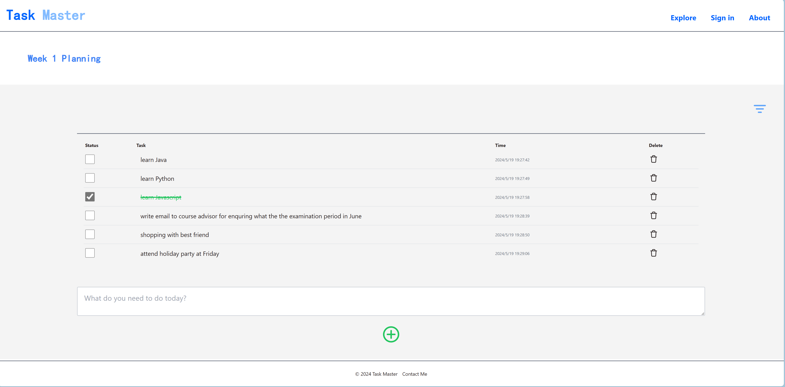
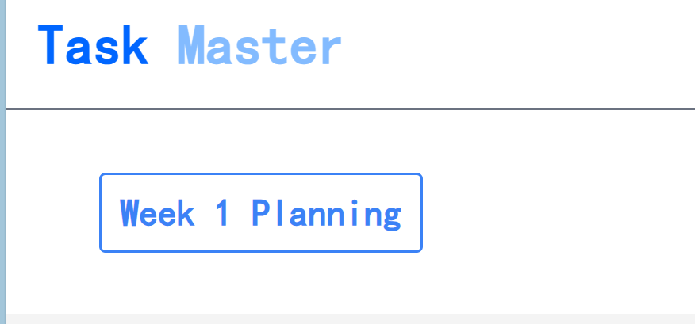
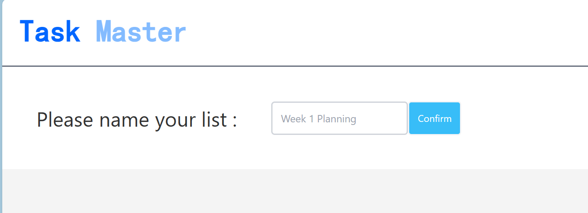
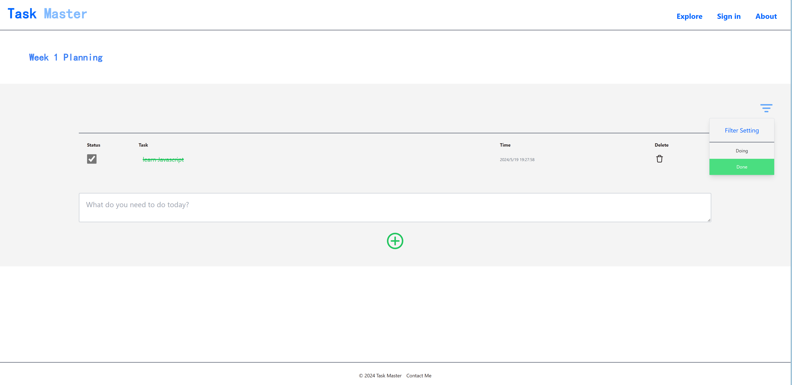

# TaskMaster

**TaskMaster** is a powerful and user-friendly web application designed to help you manage your tasks efficiently. With TaskMaster, you can easily add, delete, and modify tasks. It also offers advanced filtering options to help you organize your tasks by their completion status or by date.

## Features

- **Naming List**: Define the task list name by your preference. 
- **Add Tasks**: Quickly add new tasks to your to-do list.
- **Delete Tasks**: Remove tasks that are no longer needed.
- **Filter Tasks by Status**: View tasks based on their completion status (completed or incomplete).
- **Local Storage**: Using local storage Api to store your work despite of reloading page

## Screenshot showcase:

## Contact
- My email: benchentravail2024@gmail.com

